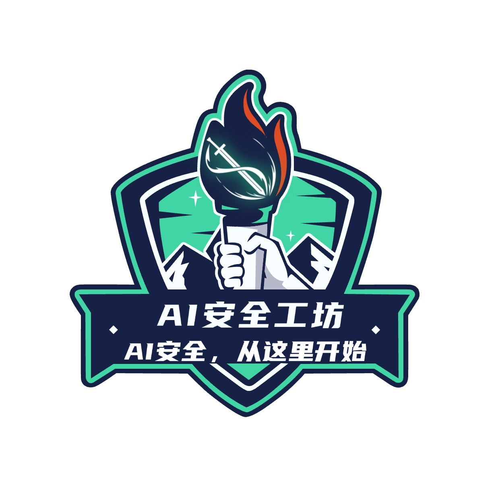

<div align="center">



# AI Security Workshop

**Production-grade security toolkit for enterprise AI deployment**

[](LICENSE)
[](https://github.com/taielab/ai-security-workshop/stargazers)
[](https://github.com/taielab/ai-security-workshop/network/members)
[](https://github.com/taielab/ai-security-workshop/commits/main)
[](https://github.com/taielab/ai-security-workshop/issues)
[](docs/contributing.md)

[中文](README.md) · **[English](README_EN.md)**

[**Quickstart**](#quick-start) · [**Articles**](#latest-articles) · [**Topics**](#topics) · [**Contributing**](#contributing) · [**Resources**](#resources)

</div>

---

> Companion to the weekly Chinese-language publication «AI 安全工坊» · Each article ships reproducible PoC + production-ready hardening + detection scripts · MIT License

## What is this

The official code repository accompanying my weekly Chinese-language publication «AI 安全工坊» (AI Security Workshop). Each article ships with:

- **Reproducible PoCs** (Python / Docker)
- **Hardening code** (production-ready)
- **Detection scripts** (one-liner to check if your company is affected)
- **Self-check checklists** (PDF / Markdown)

All code is MIT-licensed. Stars, forks, issues, and PRs are welcome.

> Companion to the WeChat blog «AI 安全工坊» — articles are written for Chinese AI / security engineers, but the technical content (CVE analysis, code, attack chains) is universally readable. English READMEs are provided for international engineers.

---

## Latest Articles

| Date | Article | Topic | Tools |
|------|---------|-------|-------|
| **2026-05-13** | [I got root inside LiteLLM in 30 lines of Python: CVE-2026-30623 in practice + hardening](articles/2026-05-13-mcp-cve-30623/) | MCP STDIO command injection | poc_vulnerable / poc_hardened / litellm_hardening |
| 2026-05-20 | LiteLLM supply-chain poisoning post-mortem (W3 — coming soon) | Supply chain | TBD |
| 2026-05-27 | Enterprise MCP deployment self-check (18 items) (W4 — coming soon) | Enterprise SOP | TBD |

---

## Topics

- 🔒 **MCP security**: Protocol-level vulns, STDIO attacks, Anthropic agent security
- 🛡️ **Agent security**: Privilege escalation, isolation models, agent runaway post-mortems
- 🔍 **Red team tools**: Pentest scripts, CVE reproduction, bug bounty toolkit
- 📋 **Enterprise self-check**: Compliance checklists, deployment SOPs, detection scripts
- 🌊 **Supply chain**: PyPI poisoning, image tampering, dependency audit
- 🐍 **Python hardening**: Allowlists, args validation, env injection defense

---

## Quick Start

### Clone

```bash
git clone https://github.com/taielab/ai-security-workshop
cd ai-security-workshop
```

### Run an article's PoC

```bash
# Example: reproduce CVE-2026-30623 (W2 article)
cd articles/2026-05-13-mcp-cve-30623/poc
pip install -r requirements.txt
python3 poc_vulnerable.py
cat /tmp/pwned.txt    # see RCE evidence
```

### Integrate the shared hardening layer in production

```python
from shared.mcp_security.allowlist import validate_mcp_command

# Call before passing user-controlled fields to StdioServerParameters
validate_mcp_command(cmd, args, env)
```

---

## Layout

```
ai-security-workshop/
├── articles/                            # One folder per article
│   ├── 2026-05-13-mcp-cve-30623/       # Weekly companion code
│   │   ├── README.md                    # Article-specific summary
│   │   ├── poc/                         # Reproduction scripts
│   │   ├── hardening/                   # Hardening code
│   │   └── reproduction/                # Full docker setup (optional)
│   └── ...
├── shared/                              # Cross-article shared code (deduped)
│   └── mcp_security/
│       ├── allowlist.py
│       └── detection.py
├── checklists/                          # Self-check lists (Markdown source)
│   └── 18-mcp-deploy-self-check.md
├── docs/                                # Long-form docs (GitHub Pages friendly)
│   ├── getting-started.md
│   ├── faq.md
│   └── contributing.md
└── .github/                             # Issue templates + CI
```

---

## Why this exists

I'm [taielab](https://github.com/taielab) — a security engineer with a long-running focus on AI security research and engineering for enterprise environments.

I've taken the full path: research → engineering → production deployment → serving real enterprise customers.

99% of AI bloggers tell you **how to use AI**. I tell you **how to use AI without getting burned**.

This repo distills the scripts from each weekly article so that you can:

1. Run PoCs to self-check whether your company is affected before deployment
2. Copy hardening code if you've already been hit
3. Build up a long-term enterprise AI security toolkit

---

## Resources

| Channel | Content | Link |
|---------|---------|------|
| WeChat blog | Weekly deep technical articles | «AI 安全工坊» (scan QR ↓) |
| Knowledge planet (Chinese) | First-hand CVE analysis + enterprise case studies | scan QR ↓ |
| GitHub | Code toolkit (this repo) | [taielab/ai-security-workshop](https://github.com/taielab/ai-security-workshop) |
| Personal WeChat | Engineer-to-engineer chat / enterprise AI security consulting (note your context) | scan QR ↓ |

### QR Codes

> Note: WeChat blog and Knowledge Planet are Chinese-language platforms. For English-speaking engineers, prefer GitHub Issues or email (via GitHub profile).

<table>
  <tr>
    <td align="center">
      <br/>
      <sub><b>WeChat blog «AI 安全工坊»</b><br/>Weekly deep technical articles (Chinese)</sub>
    </td>
    <td align="center">
      <br/>
      <sub><b>Knowledge Planet</b><br/>First-hand CVE + case studies (Chinese)</sub>
    </td>
    <td align="center">
      <br/>
      <sub><b>Personal WeChat</b><br/>Tech chat / enterprise AI security (note: "GitHub")</sub>
    </td>
  </tr>
</table>

---

### Other related projects

- [taielab/awesome-hacking-lists](https://github.com/taielab/awesome-hacking-lists) — 1.3k+ stars · Pentest + AI offensive/defensive tool index
- [taielab/Taie-Bugbounty-killer](https://github.com/taielab/Taie-Bugbounty-killer) — Automated bug bounty hunting
- [taielab/Taie-RedTeam-OS](https://github.com/taielab/Taie-RedTeam-OS) — Custom Ubuntu red-team OS
- [taielab/YinVulnKiller](https://github.com/taielab/YinVulnKiller) — Enterprise vulnerability scanning platform

---

## Contributing

Contributions welcome.

- Spotted a new AI security CVE / incident? File an issue with the `new-cve-report` template.
- Hit a bug while running a script? Use the `bug-report` template.
- Want to add a new tool / improve an existing script? Send a PR.

See [CONTRIBUTING.md](docs/contributing.md).

---

## Disclaimer

- All PoCs in this repo are intended **for security research, self-assessment, and patch verification only**.
- Running PoCs against systems you don't own or aren't authorized to test is illegal — **you bear all legal responsibility**.
- Reproduction scripts should only be run in isolated containers or test environments.
- Hardening code has been self-tested but is no substitute for a professional security audit.
- Audit any code in this repo before deploying to production.

---

## License

[MIT](LICENSE) — Free to use; please audit before commercial deployment.

If this repo helped you identify or remediate a real enterprise AI security risk, a ⭐ star helps me know it's worth maintaining.
