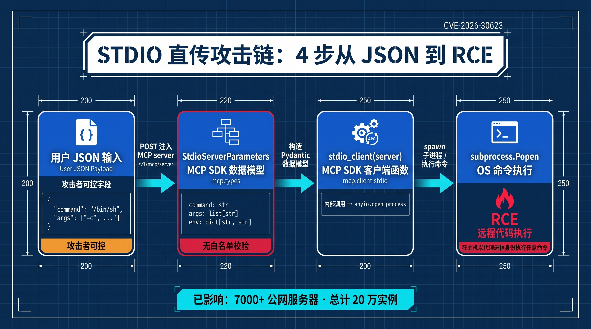
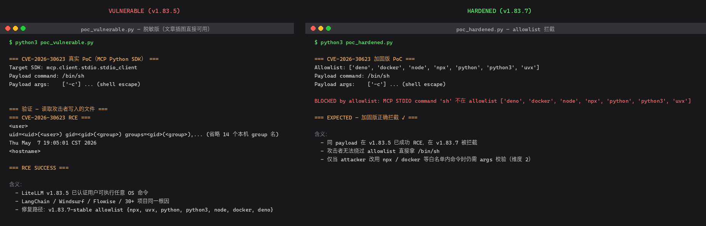
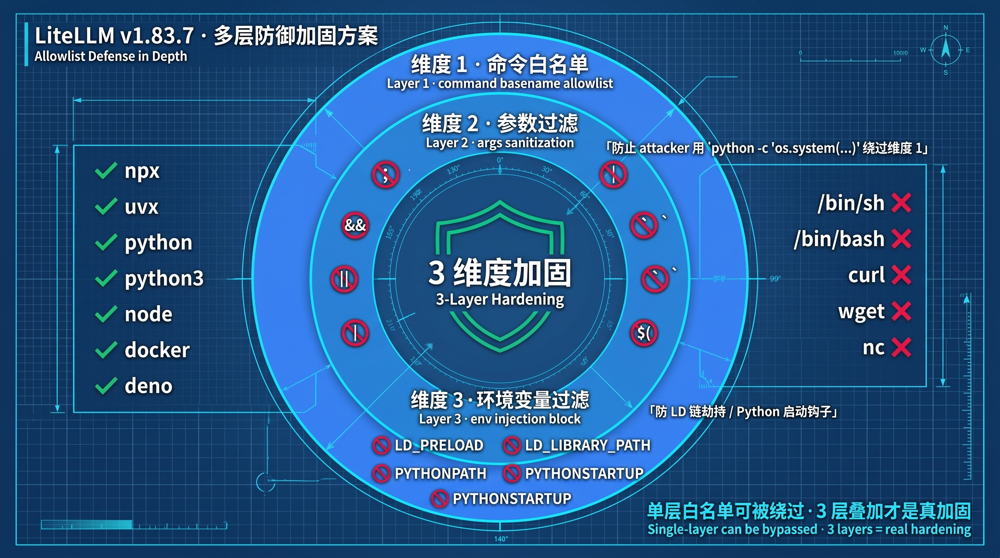

# CVE-2026-30623 · LiteLLM MCP STDIO 命令注入 · 实战 + 加固

> 配套公众号文章：[我在 30 行 Python 里拿到 LiteLLM 的 root：CVE-2026-30623 实战 + 加固](https://mp.weixin.qq.com/s/C4LBlY5nBO3GXmG9blLyJw)（2026-05-07 发布）
>
> 上游披露：[OX Security 2026-04-15](https://www.ox.security/blog/mcp-supply-chain-advisory-rce-vulnerabilities-across-the-ai-ecosystem/) · [LiteLLM Security Update](https://docs.litellm.ai/blog/mcp-stdio-command-injection-april-2026) · [GHSA-v4p8-mg3p-g94g](https://github.com/BerriAI/litellm/security/advisories/GHSA-v4p8-mg3p-g94g) · [PR #25343](https://github.com/BerriAI/litellm/pull/25343)

<p align="center">
  
</p>

---

## 漏洞速查

| 字段 | 值 |
|---|---|
| **CVE** | CVE-2026-30623 |
| **严重度** | Critical（已认证 RCE） |
| **受影响** | LiteLLM ≤ v1.83.5-nightly |
| **修复版本** | v1.83.6-nightly（首次）/ v1.83.7-stable（稳定） |
| **协议根因** | MCP Python SDK `StdioServerParameters.command` 直传 `subprocess.Popen` |
| **影响范围** | 7000+ 公网 server / 20 万实例 / 30+ 项目（LiteLLM / LangChain / LangFlow / Windsurf / Flowise / DocsGPT / Agent Zero / GPT Researcher / etc.） |

---

## 5 分钟跑通

### 1. 装依赖

```bash
pip install -r poc/requirements.txt
```

### 2. 复现漏洞（红队视角）

```bash
python3 poc/poc_vulnerable.py
cat /tmp/pwned.txt        # 看到 whoami / id / date 输出 = RCE 成功
```

### 3. 验证加固（蓝队视角）

```bash
python3 poc/poc_hardened.py   # 同 payload，预期被 allowlist 拦截
```

<p align="center">
  
  <br/>
  <sub>↑ 左：漏洞版被 RCE / 右：加固版 allowlist 拦截</sub>
</p>


### 4. 集成加固层到生产

```bash
# 自测 4 用例
python3 hardening/litellm_hardening.py

# 集成到你的 LiteLLM proxy / 自定义中间件
# 见 hardening/litellm_hardening.py 文件头部说明
```

---

## 文件清单

```
2026-05-13-mcp-cve-30623/
├── README.md                          # 本文件
├── poc/
│   ├── poc_vulnerable.py              # 红队 — 真实 RCE 复现（直接攻击 mcp.client.stdio）
│   ├── poc_hardened.py                # 蓝队 — 验证 allowlist 拦截
│   └── requirements.txt
├── hardening/
│   └── litellm_hardening.py           # 3 维度加固层（command + args + env 校验）
└── reproduction/                       # docker 完整版（备选）
    ├── docker-compose.yml             # 双容器（漏洞版 + 加固版）
    ├── config-vuln.yaml
    └── config-hardened.yaml
```

---

## 为什么用「攻击 SDK」而不是「启动 LiteLLM」复现？

LiteLLM v1.83.5-nightly 的 docker 启动栈很重：

- 强依赖 PostgreSQL + Prisma migrate
- nightly 版本本身有 entrypoint bug 卡在数据库初始化（实测浪费 30+ 分钟调试）

**更聪明的复现路径**：直接攻击 LiteLLM 内部调用的那个 SDK — `mcp.client.stdio`。

这是 **30+ 受影响项目共享的根因层**：

> "the underlying MCP Python SDK has unsanitized StdioServerParameters.command propagating to subprocess spawn" — OX Security advisory

PoC 核心只有 30 行 Python，攻击 SDK = 攻击 LiteLLM / LangChain / LangFlow / Windsurf / 全生态。

---

## 与 LiteLLM 官方修复的对应关系

LiteLLM v1.83.7-stable 在 [PR #25343](https://github.com/BerriAI/litellm/pull/25343) 的修复包含 4 层。本仓库的 `validate_mcp_command` 实现了其中通用的 2 层（Layer 1 + Layer 3），并**额外加了 Layer A / B 作为纵深防御**：

| 层 | LiteLLM 官方修复 | 本仓库 `validate_mcp_command` |
|----|------------------|-------------------------------|
| 1. Command basename allowlist | ✅ `MCP_STDIO_ALLOWED_COMMANDS` frozenset | ✅ `ALLOWED_COMMANDS` set（完全一致） |
| 2. Pydantic 入口校验（`NewMCPServerRequest` / `UpdateMCPServerRequest`） | ✅ `@model_validator(mode="before")` | ❌ 函数式实现（非 Pydantic 模型，更通用） |
| 3. Runtime 再校验（`_create_mcp_client` 防 DB 旧数据绕过） | ✅ HTTP 403 | ✅ `validate_mcp_command` 即此层 |
| 4. Endpoint 角色提升（`/mcp-rest/test/*` → `PROXY_ADMIN` only） | ✅ | ❌ LiteLLM 特有 endpoint，不在通用加固范围 |
| **A. args shell 元字符校验**（如 `python -c 'os.system(...)'` 绕过） | ❌ 未做 | ✅ 本仓库额外加 |
| **B. env 加载器变量阻断**（如 `LD_PRELOAD` 链劫持） | ❌ 未做 | ✅ 本仓库额外加 |

**残留风险**：即使 command 是白名单内的 `docker`，仍可通过 `args=["run","--rm","-it","--privileged","ubuntu","bash"]` 启 root 容器。LiteLLM 用 Layer 4（角色门控）兜底，本仓库 Layer A 的字符过滤拦不住这种 args-only 攻击。**args 业务语义校验** 留到 W4 篇覆盖。

## 3 维度加固设计理念

<p align="center">
  
</p>

单层 allowlist 可被绕过：

| 攻击者绕过手段 | 单层 allowlist | 3 维度加固 |
|---|---|---|
| 直接 `/bin/sh` | ❌ Layer 1 拦 | ❌ Layer 1 拦 |
| 改用 `python -c 'os.system(...)'` | ✅ 通过（python 在白名单）| ❌ Layer 2 args 拦元字符 |
| 改用 `npx @malicious-pkg` + 投毒 npm | ✅ 通过 | 需要 supply chain 检查（W3 篇覆盖） |
| `python` + `LD_PRELOAD=/tmp/evil.so` | ✅ 通过 | ❌ Layer 3 env 拦加载器变量 |

3 维度合在一起才是真加固。

---

## 一行检测公司是否中招

```bash
# 在你的 LiteLLM 容器里跑
pip show litellm | grep Version
# 如版本 ≤ 1.83.5 / nightly → 升级到 1.83.7-stable 或集成 hardening/litellm_hardening.py
```

---

## 风险声明

- 本工具仅用于安全研究 / 自查 / 修复验证
- 在他人系统上未经授权运行 PoC 等同于非法入侵，**法律责任自负**
- 复现脚本仅在本地容器或隔离环境运行
- 加固代码已自测 4 用例通过，但不替代专业安全审计

---

## 反馈

- 公众号「AI 安全工坊」（文章末尾微信群 / 1V1 / 知识星球）
- GitHub Issue（本仓库）
- 1V1 咨询：文章末尾微信号

下篇 W3（5-20）：[3 月 LiteLLM 被投毒 40 分钟偷走 4 大云凭证](../2026-05-20-mcp-supply-chain/)（即将上线）
